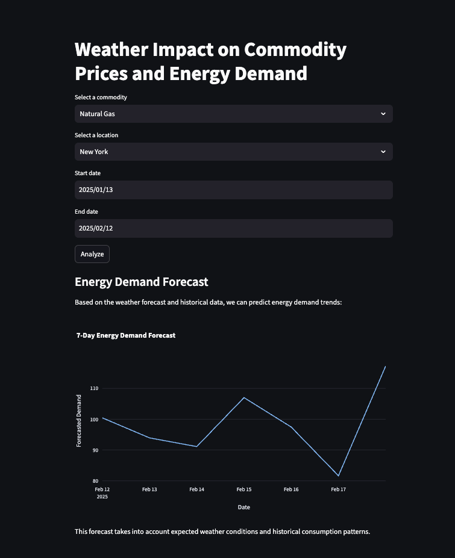
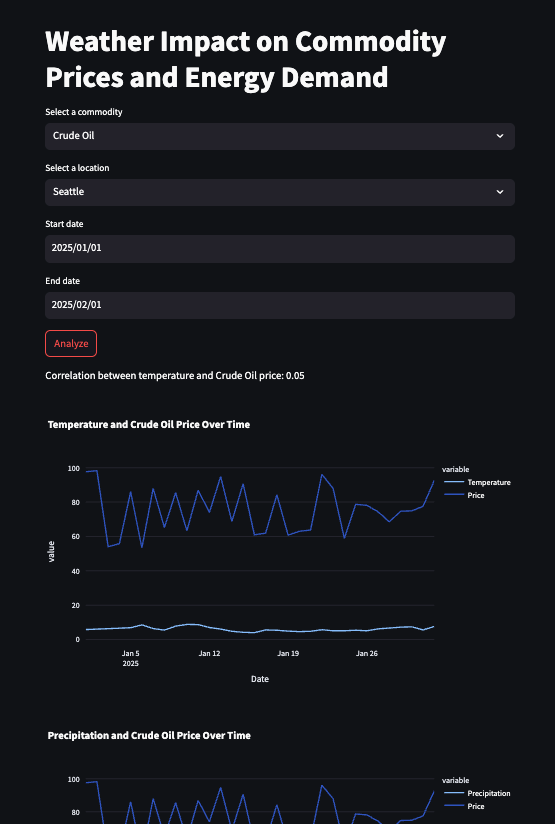
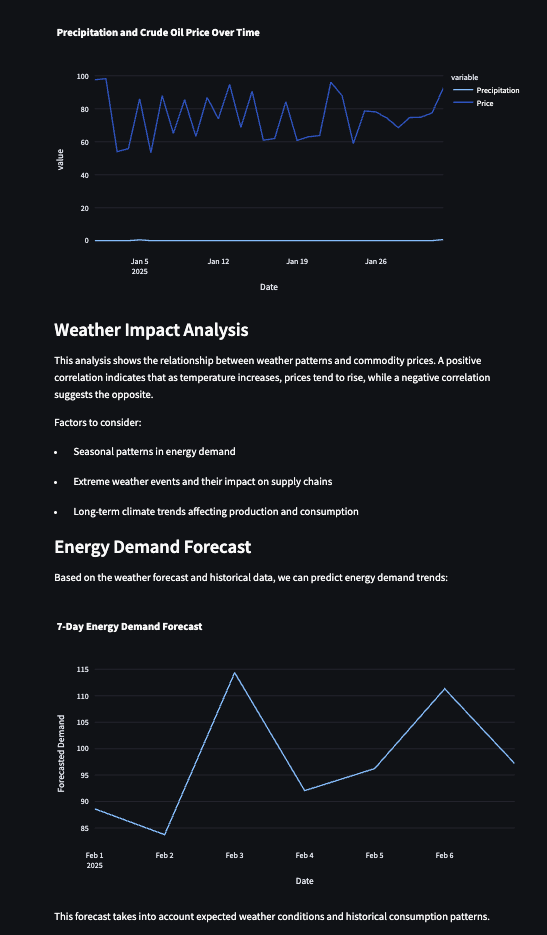

# WeatherEnergyAnalytics

## 📌 Project Overview
WeatherEnergyAnalytics is a Streamlit-based web application that analyzes how weather patterns impact commodity prices and energy demand. It provides traders and analysts with key insights by visualizing trends and forecasting demand based on weather conditions.

[Click here to watch the demo](https://private-user-images.githubusercontent.com/121528869/412711782-49d38a54-eaef-47fd-92bf-678725e2abe1.mp4?jwt=eyJhbGciOiJIUzI1NiIsInR5cCI6IkpXVCJ9.eyJpc3MiOiJnaXRodWIuY29tIiwiYXVkIjoicmF3LmdpdGh1YnVzZXJjb250ZW50LmNvbSIsImtleSI6ImtleTUiLCJleHAiOjE3Mzk0MjEwNjUsIm5iZiI6MTczOTQyMDc2NSwicGF0aCI6Ii8xMjE1Mjg4NjkvNDEyNzExNzgyLTQ5ZDM4YTU0LWVhZWYtNDdmZC05MmJmLTY3ODcyNWUyYWJlMS5tcDQ_WC1BbXotQWxnb3JpdGhtPUFXUzQtSE1BQy1TSEEyNTYmWC1BbXotQ3JlZGVudGlhbD1BS0lBVkNPRFlMU0E1M1BRSzRaQSUyRjIwMjUwMjEzJTJGdXMtZWFzdC0xJTJGczMlMkZhd3M0X3JlcXVlc3QmWC1BbXotRGF0ZT0yMDI1MDIxM1QwNDI2MDVaJlgtQW16LUV4cGlyZXM9MzAwJlgtQW16LVNpZ25hdHVyZT03YzQ1M2NlZTdhNTkxM2QwYTg2MjkwODhlZTVlYzQ4MGY1MGE1ZTE2OGJlMDUwMmNhY2EwMzJjNThjZDcxNWU3JlgtQW16LVNpZ25lZEhlYWRlcnM9aG9zdCJ9.adI33-BvNzqQ7gkyM7QC8dnTy9Yevv1AJ4fT_aDHTiU)

## 🚀 Features
- Select a commodity (Natural Gas, Crude Oil, Electricity)
- Choose a location (New York, Chicago, Houston)
- Analyze historical weather and price trends
- View interactive charts on temperature, precipitation, and commodity prices
- Get a mock 7-day energy demand forecast
- Uses real weather data from the Open-Meteo API

## Picture Demo

## Skills Shown
- Fullstack Development
- API Integration
- Data Analysis & Visualization

## 🛠 Installation
1. Clone the repository:
   - git clone https://github.com/jnima2022/WeatherEnergyAnalytics.git
   - cd WeatherEnergyAnalytics

2. Create a virtual environment and activate it:
   - python -m venv .venv
   - source .venv/bin/activate  # On Windows use: .venv\Scripts\activate

3. Install dependencies:
   - pip install -r requirements.txt

4. Run the application:
   - streamlit run app.py

## 📊 Data Sources
- **Weather Data:** Open-Meteo API
- **Commodity Prices:** Mock data (can be replace with a financial API for real prices)

## Tech Stack

- **Streamlit**: Interactive web app framework for data visualization.
- **Pandas**: Data handling and manipulation.
- **Plotly**: Interactive charts for time series data.
- **Requests**: Fetching weather data from external APIs.
- **NumPy**: Generating mock data for commodity prices.
- **Python**: Core programming language for app logic.
- **Datetime**: Handling time-related data.

## How It Can Be Improved

- **Real API Integration**: Replace mock commodity price data with real market data APIs.
- **Advanced Analytics**: Add machine learning models to predict commodity prices.
- **Scalability**: Store historical data in a database and add caching.
- **Customization**: Allow users to input their own location and commodity.
- **UI Enhancements**: Improve styling and interactivity for a polished look.