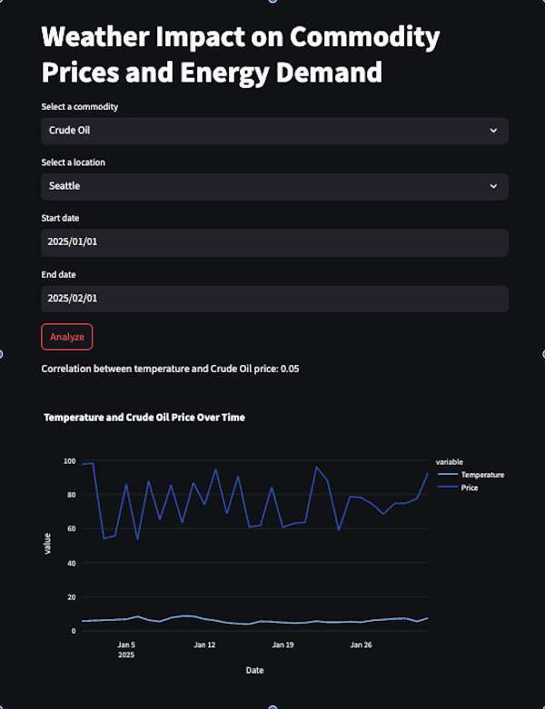

# WeatherEnergyAnalytics

## 📌 Project Overview
WeatherEnergyAnalytics is a Streamlit-based web application that analyzes how weather patterns impact commodity prices and energy demand. It provides traders and analysts with key insights by visualizing trends and forecasting demand based on weather conditions.

[Click here to watch the demo](https://github.com/jnima2022/WeatherEnergyAnalytics/issues/1#issue-2849892519)

## 🚀 Features
- Select a commodity (Natural Gas, Crude Oil, Electricity)
- Choose a location (New York, Chicago, Houston)
- Analyze historical weather and price trends
- View interactive charts on temperature, precipitation, and commodity prices
- Get a mock 7-day energy demand forecast
- Uses real weather data from the Open-Meteo API

## Picture Demo

## Skills Shown
- Fullstack Development
- API Integration
- Data Analysis & Visualization

## 🛠 Installation
1. Clone the repository:
   git clone https://github.com/jnima2022/WeatherEnergyAnalytics.git
   cd WeatherEnergyAnalytics

2. Create a virtual environment and activate it:
   python -m venv .venv
   source .venv/bin/activate  # On Windows use: .venv\Scripts\activate

3. Install dependencies:
   pip install -r requirements.txt

4. Run the application:
   streamlit run app.py

## 📊 Data Sources
- **Weather Data:** Open-Meteo API
- **Commodity Prices:** Mock data (can be replace with a financial API for real prices)